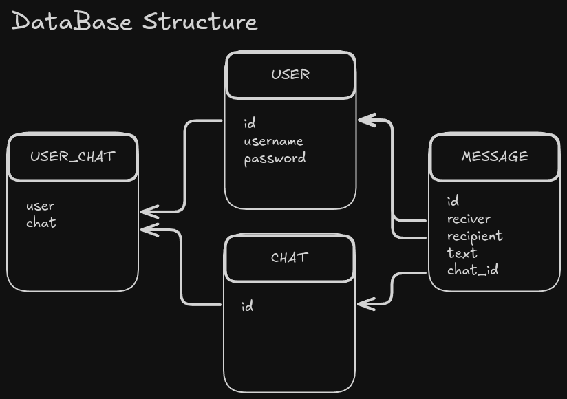
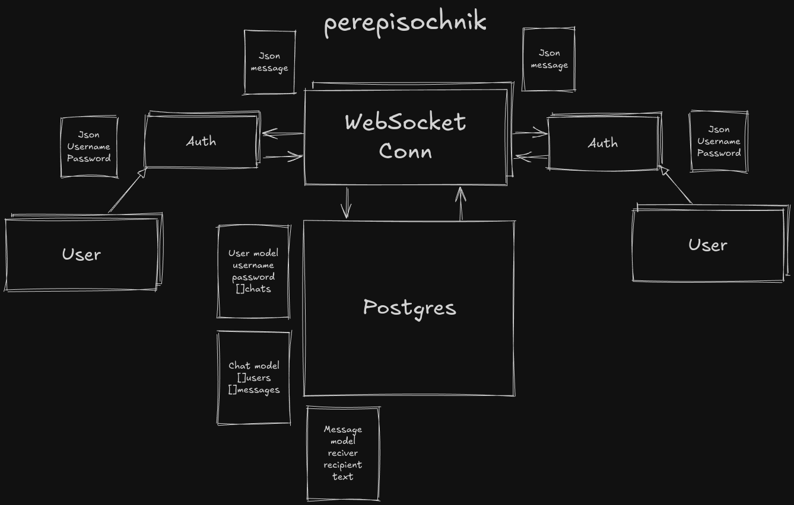

# Perepisochnik (пэт-проект)
## Серверная часть приватного мессенджера

### Handlers:
- **Chat:**
``` 
/ "GET" - Все чаты
/chat{id} "GET" - Возвращает чат по id
/chat "POST" - Создание нового чата
/chat{id} "DELETE" - Удаление чата по id
/chat{id} "PUT" - Изменение чата по id
```
---
- **User**
```
/usr "POST" - Создание нового пользователя
/usr{id} "GET" - Возвращает пользователя по id
/usr{id} "DELETE" - Удаление пользователя по id
/usr{id} "PUT" - Изменение пользователя по id
```
---
- Аунтентификация с помощью JWT токена
```
/auth "POST" - аунтентификация и получение JWT токена
```
### Структура базы данных

## Общая структура приложения

